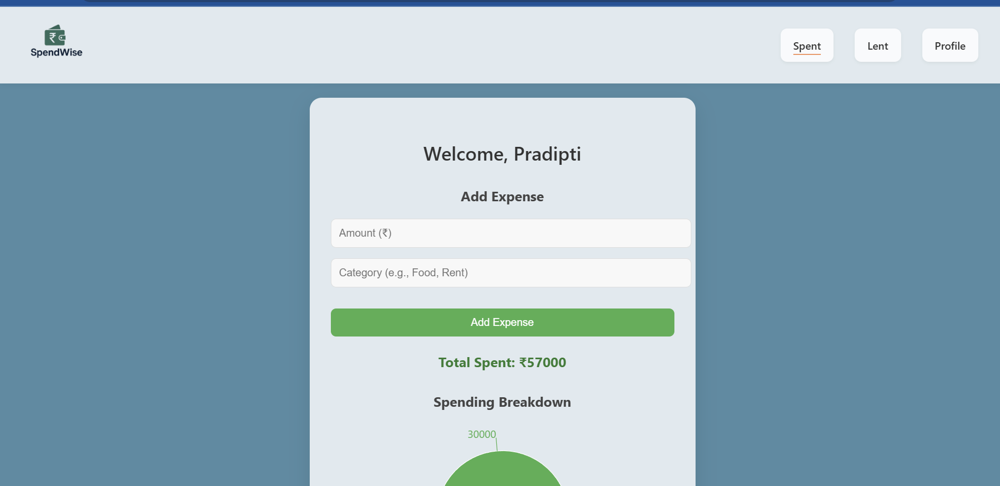

# 💸 SpendWise

A clean and simple personal finance tracker built with **React** and **Firebase**.  
Track your daily expenses, visualize your spending patterns, and take control of your money — all in one app.

---

## Live Demo
Check out the live app here: [SpendWise – Live App](https://finance-c67ef.web.app)

---

## Preview

  

  
  

  

---

## Features

- Total Spend Summary: Instantly view your overall spending at the top
- Breakdown of Expenses: Category-wise pie chart to understand spending patterns
- Add/Delete Expenses: Record daily expenses with category and amount
- Add/Delete Lent Entries: Track money lent to others and manage repayments
- Profile Settings: Change username and password with Firebase Authentication
- Real-Time Updates: All actions sync live via Firebase Firestore
- Deployed on Firebase Hosting: Accessible across devices instantly